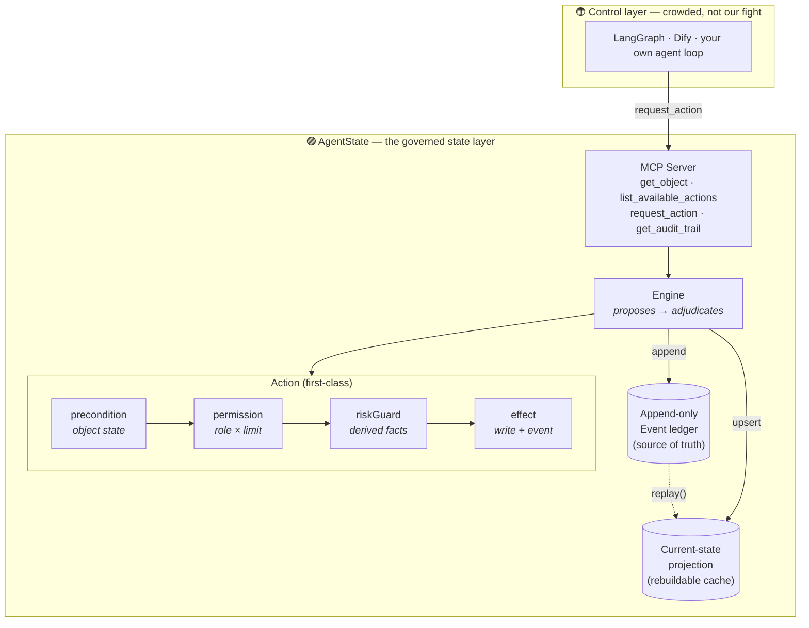

<div align="center">

# AgentState

### Agents have memory. They don't have state.

**An open, governed state layer that sits under any agent framework —**
**so an agent's actions aren't just *smart*, they're *trustworthy*.**
The model *proposes*; a deterministic engine *adjudicates*; every change is an event.

[](LICENSE)
[](package.json)
[](tsconfig.json)
[](https://modelcontextprotocol.io)
[](docs/ROADMAP.md)
[](CONTRIBUTING.md)

[Quickstart](docs/quickstart.md) · [Manifesto](docs/manifesto.md) · [Architecture](docs/ARCHITECTURE.md) · [Roadmap](docs/ROADMAP.md) · [FAQ](docs/FAQ.md) · [中文](README.zh-CN.md)

<a href="https://github.com/xl-1995/agentstate/releases/download/v0.0.1/agentstate-promo.mp4"></a>

▶ **[Watch the full video, with sound](https://github.com/xl-1995/agentstate/releases/download/v0.0.1/agentstate-promo.mp4)** &nbsp;·&nbsp; source: [`media/promo`](media/promo)

</div>

---

## The bottleneck is no longer intelligence. It's trust.

Models keep getting smarter. That was never the thing stopping you from putting an agent in charge of real money, real records, real customers. The thing stopping you is that you cannot *trust* what it will do — and cannot *prove* what it did.

A smarter model still has no authoritative answer to "has this already happened?" It still has no limit it cannot exceed. It still leaves no record you can audit. Intelligence and trust are **different axes**, and almost the entire ecosystem has optimized only the first.

> ### AgentState doesn't make the model smarter. It makes the agent trustworthy.

It does that by pulling the handful of operations that actually change the world out of free-text reasoning and into typed, governed **actions** — each adjudicated against real state, role limits, and risk rules, and each written to an append-only ledger. The model *proposes*; a deterministic engine *decides*; every change is an event you can replay. It is **not another agent framework** — it's the layer of trust the smart part runs on top of.

---

## Smart vs. trustworthy

These are two different jobs. AgentState owns the second.

| | The model's job | **AgentState's job** |
|---|---|---|
| Provides | **Intelligence** — understand, plan, draft, decide *what to propose* | **Trust** — govern, bound, and record *what is allowed to happen* |
| Gets better with | A bigger/smarter model | A better-defined boundary |
| Removes the failure | "It didn't understand" | **"It did something it shouldn't have — and no one can say why"** |
| "Did X already happen?" | A guess from memory | **An authoritative value from state** |
| "Why did X happen?" | Re-read the transcript | **One row in the audit ledger** |
| "Could it ever do Y?" | Hope the prompt holds | **A precondition that makes Y impossible** |

Capability you can buy by upgrading the model. **Trust you have to *architect*.** That architecture is what AgentState is — and because it's deterministic, the guarantees hold no matter which model sits on top, today's or next year's.

---

## Memory is not State

LLM "memory" is a stack of notes that get re-read every turn, can be read out of order, and have no single authoritative *now*. That's the right tool for *what was said*. It is the wrong substrate for *what is true*.

|                | **Memory** | **State** |
|----------------|------------|-----------|
| Answers        | "What was said?" | "What is true — has this payment cleared? is this order shipped?" |
| Shape          | Append-only notes, recalled & summarized | One authoritative value per object |
| Changed by     | The model, freely | Only governed actions, adjudicated |
| Failure mode   | Forgets, repeats, conflates | — (it cannot do the same thing twice) |
| Lives in       | The chat log | The state layer |

Most agent stacks blur the two and let the model write directly to the world. That is exactly where trust leaks out. AgentState keeps the conversation in the chat log where it belongs, and gives the *world* a layer of its own.

---

## The model: four primitives

The **grammar** is identical across domains; only the **vocabulary** changes.

| Primitive | What it is |
|-----------|-----------|
| **Object** | A typed, persistent record of the situation right now (`Order`, `Ticket`). Identified by `(type, id)`. |
| **Action** | A first-class, governed operation — the *only* way state changes. Carries `precondition → permission → riskGuard → effect`. |
| **Event** | An append-only ledger entry: who acted, on what state, why it was allowed, and the result. |
| **Projection** | Current state is a fold over the ledger — `replay()` rebuilds it from events alone. |



An action **declares** its guards instead of burying them in if-else:

```ts
export const issueRefund: ActionDef = {
  name: "issue_refund",
  input: z.object({ order_id: z.string(), amount: z.number().positive(), reason: z.string().min(1) }),

  precondition(ctx) {                       // invariants bound to object state
    const o = ctx.get("Order", ctx.input.order_id);
    if (!o) deny("order_not_found", "...");
    if (ctx.input.amount > o.amount - o.refunded_amount)
      deny("refund_exceeds_remaining", "...");      // a double refund is impossible
  },
  permission(ctx) {                         // authority bound to role × amount
    if (ctx.input.amount > REFUND_LIMIT[ctx.actor.role]) requireApproval("...", "senior");
  },
  riskGuard(ctx) {                          // abuse bound to derived facts (90-day total)
    /* sum prior RefundIssued events for this customer → require approval over threshold */
  },
  effect(ctx) {                             // the state change + the event to record
    return { writes: [updatedOrder], event: { type: "RefundIssued", /* ... */ } };
  },
};
```

The LLM never reaches `effect`. It can only `request_action`; the engine runs the guards and decides. See [`docs/ARCHITECTURE.md`](docs/ARCHITECTURE.md) for the full request lifecycle.

---

## See it, in one example

The repo ships **one worked example** to make the idea concrete — it happens to be customer support, but the grammar is the point, not the domain. A plain agent calls an API directly and double-pays; the same agent, through AgentState, is told *no* the second time and leaves a receipt:

```text
# plain agent, no state layer
💸 paid out $300 on a $150 order — no record, no idea it double-paid

# same agent, through AgentState
✅ APPLIED          refund $150                       → RefundIssued
⛔ DENIED           refund $150 again                 → already refunded (idempotent via state)
✋ NEEDS_APPROVAL   $800 refund exceeds role limit    → escalates to a supervisor
✅ APPLIED          …approved by supervisor           → RefundIssued, approval on the record
```

Not *smarter* — the model proposed the same thing both times. *Trustworthy* — the second world refused to let it happen, and can tell you why. Run it yourself:

```bash
git clone https://github.com/xl-1995/agentstate && cd agentstate
npm install
npm run demo      # naive agent vs. governed agent, side by side
npm test          # the guarantees: allowed / denied / needs-approval / replay
```

---

## Use it from an MCP client (Claude Desktop, etc.)

AgentState ships as a [Model Context Protocol](https://modelcontextprotocol.io) server exposing exactly four tools:

`get_object` · `list_available_actions` · `request_action` · `get_audit_trail`

```bash
npm run mcp        # serves the customer-support example over stdio
```

```jsonc
// claude_desktop_config.json
{
  "mcpServers": {
    "agentstate": {
      "command": "npx",
      "args": ["tsx", "examples/customer-support/mcp.ts"],
      "cwd": "/absolute/path/to/agentstate"
    }
  }
}
```

Now ask Claude to refund the same order twice — it physically cannot, and `get_audit_trail` shows you exactly why.

---

## How it compares

| | Owns | AgentState's relationship |
|---|---|---|
| **LangGraph / Dify / OpenClaw** | Control: routing, orchestration | Sits **underneath** — they call `request_action` |
| **Palantir Foundry** | Enterprise object+action+audit | Same idea, but heavyweight, closed, expensive. AgentState is the thin, open, self-hosted version |
| **Temporal / durable execution** | Reliable *execution* of workflows | Complementary — AgentState governs *what is allowed to change*, not how a workflow runs |
| **Postgres + a few validators** | Storage + ad-hoc checks | What you build by hand, again, per project. AgentState makes the governance grammar a reusable primitive |

Full breakdown in [`docs/comparison.md`](docs/comparison.md).

---

## What's in here

```
agentstate/
├── src/
│   ├── core/        Object · Action · Policy guards · Event · Engine
│   ├── storage/     SQLite append-only ledger + rebuildable projection
│   └── mcp/         the four governed MCP tools
├── examples/
│   └── customer-support/   schema · actions · seed · the comparison demo
├── test/            allowed / denied / needs-approval / replay
└── docs/            manifesto · architecture · roadmap · faq · comparison · blog
```

## Documentation

| Doc | What it covers |
|-----|----------------|
| [Manifesto](docs/manifesto.md) | Why memory ≠ state, and the four claims behind the design |
| [Architecture](docs/ARCHITECTURE.md) | The request lifecycle, guard pipeline, ledger & projection, extension points |
| [Quickstart](docs/quickstart.md) | Run the demo, wire up MCP, define your own action |
| [Roadmap](docs/ROADMAP.md) | v0 → v1 → beyond, and the open-core philosophy |
| [FAQ](docs/FAQ.md) | "Isn't this just event sourcing?" and other sharp questions |
| [Comparison](docs/comparison.md) | vs agent frameworks, Palantir, Temporal, raw databases |
| [Blog: the wrong layer](docs/blog/agent-frameworks-built-the-wrong-layer.md) | The long-form argument |

## Status

`v0` — deliberately minimal: core runtime + MCP server + one worked example + the demo. No Studio, no UI, no multi-tenancy, no connectors yet. The point of v0 is a single command that demonstrates the core promise — an agent the model cannot talk out of the rules, with a receipt for everything it did. The roadmap explains what's next and, just as importantly, what we're *not* rushing to build.

## Contributing

New example domains, storage backends, and tests around the guard pipeline are especially welcome. See [`CONTRIBUTING.md`](CONTRIBUTING.md).

## License

[Apache-2.0](LICENSE) — patent grant included, enterprise-safe. The grammar is meant to be a standard; build your vocabulary on top of it.
