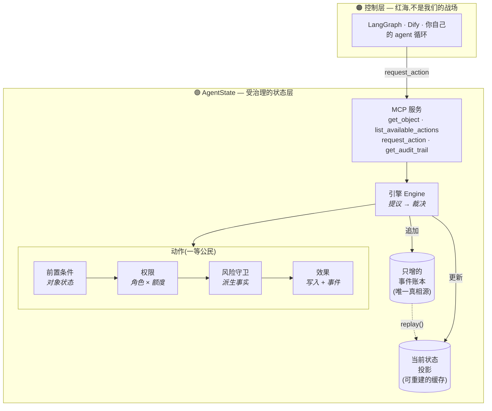

<div align="center">

# AgentState

### Agent 有记忆,却没有状态。

**一个开源的、受治理的「状态层」,坐在所有 agent 框架的下面。**
模型只负责*提议*;一个确定性引擎负责*裁决*;每一次改变都是一条事件。

[](LICENSE)
[](package.json)
[](tsconfig.json)
[](https://modelcontextprotocol.io)
[](docs/ROADMAP.md)

[快速开始](docs/quickstart.md) · [宣言](docs/manifesto.md) · [架构](docs/ARCHITECTURE.md) · [路线图](docs/ROADMAP.md) · [English](README.md)

</div>

---

Agent 记得你*说过*什么,却不知道这笔退款是不是*已经退过了*。于是它翻了一遍聊天记录,判断「好像我们还欠一笔退款」,然后——把钱退了第二次。

整个 agent 生态,把力气都砸在了**控制层**:谁来调度、怎么派活、哪个工具触发。这一层已经是红海。而在它下面,藏着一个更安静、却没人认领的问题:

> **现在世界的真相到底是什么?这个 agent 又被允许对它做哪些改变?**

AgentState 就是这个问题的答案——做成一层薄薄的、开放的基础设施。它把少数几个会真正「改变世界」的操作,从自由文本的推理里抽出来,变成有类型、受治理的**动作(Action)**;每一个动作都要经过对象状态、角色额度、风险规则的裁决;每一次改变都落进一本只增不改的账本。

它**不是又一个 agent 框架**——它是任何 agent 在动真实业务之前,都该先过的那道状态闸门。

---

## 30 秒演示

一个普通 agent,直接调退款 API。它退了两次:

```text
💸 订单 o-1001 在一笔 $150 的订单上,付出去了 $300。
   没有记录为什么。它根本不知道自己重复付款了。这就是今天的默认状态。
```

同一个 agent,经过 AgentState:

```text
✅ 通过        anna 给 o-1001 退款 $150           → RefundIssued
⛔ 拒绝        anna 再次给 o-1001 退款 $150        → refund_exceeds_remaining:已退过 150
✋ 需审批      anna(客服,≤$200)退款 $800        → 超出客服额度 200
✅ 通过        …由 Sara(主管)审批后             → RefundIssued
⛔ 拒绝        有未兑现承诺时关闭工单              → 1 个未兑现承诺:t-1-p1(pending)
```

自己跑一遍——一次安装,一条命令:

```bash
git clone https://github.com/xl-1995/agentstate && cd agentstate
npm install
npm run demo      # 普通 agent vs 受治理 agent,左右对照
npm test          # 四条保证:通过 / 拒绝 / 需审批 / 账本可回放
```

---

## 记忆 ≠ 状态

LLM 的「记忆」,是一摞每一轮都要重读、可能读串、没有唯一权威「现状」的笔记。这套东西适合记录*说过什么*,却恰恰是*什么是真的*这件事最糟糕的载体。

|            | **记忆 Memory** | **状态 State** |
|------------|-----------------|----------------|
| 回答的问题  | 「客户跟我们说了什么?」 | 「这笔退款退了没?这张工单关了没?」 |
| 形态        | 只增的笔记,被召回、被摘要 | 每个对象一个唯一权威值 |
| 谁能改      | 模型,随意改 | 只有受治理的动作,经裁决后才改 |
| 失败方式    | 会忘、会重复、会读串 | ——(它没法退两次款) |
| 存在哪      | 聊天记录里 | 状态层里 |

今天大多数 agent 栈把这两者混为一谈,放任模型直接写真实世界。AgentState 把对话留在它该在的聊天记录里,而给**世界**单独一层。

---

## 模型:四个原语

**语法**跨行业是同一套,变的只是**词汇**。

| 原语 | 是什么 |
|------|--------|
| **对象 Object** | 一条有类型、持久化的记录,描述「此刻的现状」(`Order`、`Ticket`),用 `(type, id)` 标识 |
| **动作 Action** | 一等公民、受治理的操作——改变状态的*唯一*途径,带 `前置条件 → 权限 → 风险守卫 → 效果` |
| **事件 Event** | 只增账本里的一条:谁、基于什么状态、为什么放行、结果如何 |
| **投影 Projection** | 当前状态是事件的累加结果——`replay()` 能仅凭事件把它重建出来 |



动作把守卫**声明**出来,而不是埋进一堆 if-else:

```ts
export const issueRefund: ActionDef = {
  name: "issue_refund",
  input: z.object({ order_id: z.string(), amount: z.number().positive(), reason: z.string().min(1) }),

  precondition(ctx) {                       // 绑在对象状态上的不变量
    const o = ctx.get("Order", ctx.input.order_id);
    if (!o) deny("order_not_found", "...");
    if (ctx.input.amount > o.amount - o.refunded_amount)
      deny("refund_exceeds_remaining", "...");      // 重复退款在结构上不可能
  },
  permission(ctx) {                         // 绑在角色 × 金额上的授权
    if (ctx.input.amount > REFUND_LIMIT[ctx.actor.role]) requireApproval("...", "senior");
  },
  riskGuard(ctx) {                          // 绑在派生事实上的滥用守卫(90 天累计)
    /* 累加该客户过往的 RefundIssued 事件 → 超阈值转审批 */
  },
  effect(ctx) {                             // 状态改变 + 要记录的事件
    return { writes: [updatedOrder], event: { type: "RefundIssued", /* ... */ } };
  },
};
```

LLM 永远碰不到 `effect`。它只能 `request_action`;引擎跑完守卫,自己裁决。完整的请求生命周期见 [`docs/ARCHITECTURE.md`](docs/ARCHITECTURE.md)。

---

## 在 MCP 客户端里用(Claude Desktop 等)

AgentState 以 [Model Context Protocol](https://modelcontextprotocol.io) 服务的形态发布,只暴露四个工具:

`get_object` · `list_available_actions` · `request_action` · `get_audit_trail`

```bash
npm run mcp        # 以 stdio 形式跑起客服示例
```

```jsonc
// claude_desktop_config.json
{
  "mcpServers": {
    "agentstate": {
      "command": "npx",
      "args": ["tsx", "examples/customer-support/mcp.ts"],
      "cwd": "/绝对路径/agentstate"
    }
  }
}
```

然后让 Claude 给同一笔订单退两次款——它在物理上做不到,而 `get_audit_trail` 会把原因一条条摆给你看。

---

## 它和谁不一样

| | 占住的是 | AgentState 与它的关系 |
|---|---|---|
| **LangGraph / Dify / OpenClaw** | 控制层:路由、编排 | 坐在它们**下面**——它们来调 `request_action` |
| **Palantir Foundry** | 企业级的「对象+动作+审计」 | 同一个思路,但重、封闭、贵。AgentState 是那个薄的、开源的、自有数据就能跑的版本 |
| **Temporal / 持久化执行** | 工作流的*可靠执行* | 互补——AgentState 治理的是*什么被允许改变*,不是工作流怎么跑 |
| **Postgres + 几个校验函数** | 存储 + 临时校验 | 那是你每个项目手搓一遍的东西。AgentState 把这套治理语法变成一个可复用的原语 |

完整对比见 [`docs/comparison.md`](docs/comparison.md)。

---

## 当前状态

`v0` —— 刻意做到最小:核心运行时 + MCP 服务 + 一个打磨过的示例 + 那个对照演示。没有 Studio、没有界面、没有多租户、还没有连接器。v0 的全部意义,就是**一条命令跑起来、当场让一个受治理的 agent 把普通 agent 比下去**。路线图里写清楚了接下来做什么,以及——同样重要——我们*不急着*做什么。见 [`docs/ROADMAP.md`](docs/ROADMAP.md)。

## 许可证

[Apache-2.0](LICENSE) —— 含专利授权、企业可安心使用。这套语法想成为一个标准;你的词汇,建在它之上。
