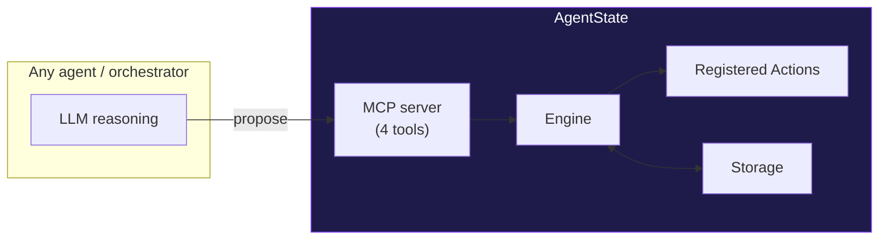
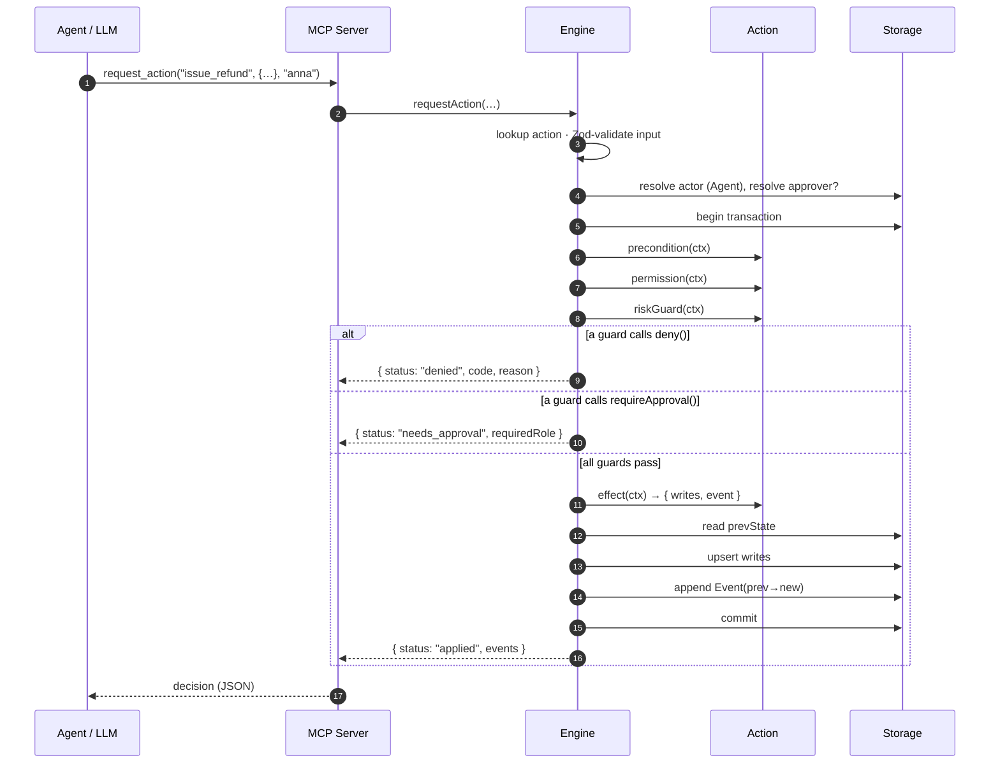
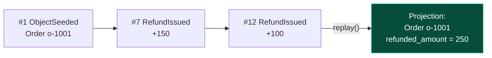

# Architecture

This document explains how AgentState is put together: the request lifecycle, the guard pipeline, the event ledger and its projection, and where to extend it. The design has one north star:

> **The model proposes; a deterministic engine adjudicates; every change is an event.**

If a change to the code blurs that line, it belongs in an example or a separate package — not in the core.

---

## 1. The layers



- **MCP server** (`src/mcp/server.ts`) — the boundary. Exposes four tools and nothing else. The model can read state and *propose* actions; it cannot reach into the engine.
- **Engine** (`src/core/engine.ts`) — the adjudicator. Validates input, resolves the actor, runs the guard pipeline inside a transaction, and turns guard signals into a `Decision`.
- **Actions** (`ActionDef`) — first-class, declarative operations. Registered onto the engine; they hold the domain rules.
- **Storage** (`src/core/storage.ts` + `src/storage/`) — the append-only event ledger plus a rebuildable current-state projection.

---

## 2. The request lifecycle

Every call to `requestAction(name, input, actorId, opts)` follows the same path:



The whole body runs inside `storage.transaction(...)`. A denied or needs-approval outcome is raised as a typed signal (`ActionDenied` / `ApprovalRequired`), caught by the engine, and returned as a `Decision` — it never escapes as a thrown error, and it never leaves a partial write behind.

---

## 3. The guard pipeline

An `ActionDef` separates governance into four named stages so that *where a rule lives* tells you *what kind of rule it is*:

| Stage | Bound to | Example | On failure |
|-------|----------|---------|-----------|
| `input` (Zod) | The shape of the request | `amount` must be a positive number | `denied: invalid_input` |
| `precondition` | **Object state** | order is `paid/shipped/delivered`, within window, not already refunded | `deny(code, msg)` |
| `permission` | **Role × limit** | `agent ≤ 200`, `senior ≤ 1000`, over-limit needs a higher role | `requireApproval(msg, role)` |
| `riskGuard` | **Derived facts** | 90-day cumulative refunds for this customer | `requireApproval(...)` |
| `effect` | — | compute the new object state + the event | runs only if all above pass |

Two signals drive control flow:

```ts
deny("refund_exceeds_remaining", "Refund 150 exceeds remaining 0");   // hard no, stable code
requireApproval("exceeds agent limit 200", "senior");                 // soft no, re-submittable
```

A `needs_approval` action is retried with `{ approvedBy: "<agent-id>" }`. The guard decides whether the approver is sufficient — typically "the approver outranks the actor":

```ts
function approverOutranks(ctx) {
  return !!ctx.approval && ROLE_RANK[ctx.approval.approver.role] > ROLE_RANK[ctx.actor.role];
}
```

This keeps compliance where it belongs: regulations and business rules are, at bottom, *constraints on which action is permitted given the current state* — so they live as preconditions and limits on typed actions, not buried in a prompt or a tool's branches.

---

## 4. The event ledger & projection

State is not stored as a mutable blob you overwrite. It is a **fold over an append-only ledger**.



- **`events`** is the source of truth: only ever appended, never updated. Each row carries `who · on what state (prev→new) · why (reason/approval) · result`.
- **`objects`** is a projection: a cache of the latest snapshot per `(type, id)`, updated transactionally alongside each event.
- **`replay()`** wipes `objects` and rebuilds it by folding every event's resulting snapshot in `seq` order. The demo asserts the rebuilt state is byte-identical to the live state — proof that state really is "just" a projection.

Because even seed data enters through a genesis `ObjectSeeded` event, the ledger is *complete*: nothing exists in the projection that the ledger can't reconstruct.

**Why this matters for agents specifically:** when the boss asks "why was this order refunded $800?", the answer is a row in the ledger — `by anna, approved by sara, reason: late delivery` — not a hunt through a chat transcript. Auditability isn't a feature bolted on; it's the storage model.

---

## 5. Idempotency

There is no separate "idempotency key" machinery. Idempotency falls out of binding actions to state:

> `issue_refund` requires `amount ≤ order.amount − order.refunded_amount`.

Once an order is fully refunded, `remaining` is `0`, and every further refund is denied by the precondition. The second refund isn't *detected and rejected* — it's *structurally impossible*. The same pattern generalizes: "ship once" is `status == paid`; "close once" is `status != closed`.

---

## 6. Storage interface & extension points

The engine depends only on the `Storage` interface (`src/core/storage.ts`):

```ts
interface Storage {
  getObject(type, id): AgentObject | null;
  allObjects(type?): AgentObject[];
  upsertObject(obj): void;
  appendEvent(event): Event;          // assigns monotonic seq
  listEvents(filter?): Event[];
  transaction<T>(fn): T;
  reset(): void;
  replay(): void;
  close(): void;
}
```

`SqliteStorage` is the reference implementation (in-memory for tests, file-backed to persist). To run on Postgres, implement this interface against it — the engine, actions, and MCP server are unchanged. Three clean extension points:

1. **New storage backend** — implement `Storage`.
2. **New domain** — write `ActionDef`s + a seed, register them on an `Engine`. The core never learns your vocabulary.
3. **New transport** — the MCP server is one adapter over the engine; a REST or gRPC adapter is the same four operations.

---

## 7. Design choices, briefly

- **TypeScript, ESM, run via `tsx`.** No build step in development; the MCP ecosystem and `npx` distribution are first-class.
- **SQLite first.** An append-only ledger is exactly what a single-file embedded DB is good at; the `Storage` seam keeps Postgres a drop-in.
- **Declarative guards over a rule engine.** A lightweight, explicit pipeline is easier to read, test, and reason about than a heavyweight DSL — and the guard *names* carry meaning.
- **Snapshots in events.** Storing `prev/new` object snapshots makes `replay()` a trivial, dependency-free fold and makes every event self-explanatory in an audit.

For the philosophy behind these mechanics, read the [Manifesto](manifesto.md). For where it's going, the [Roadmap](ROADMAP.md).
