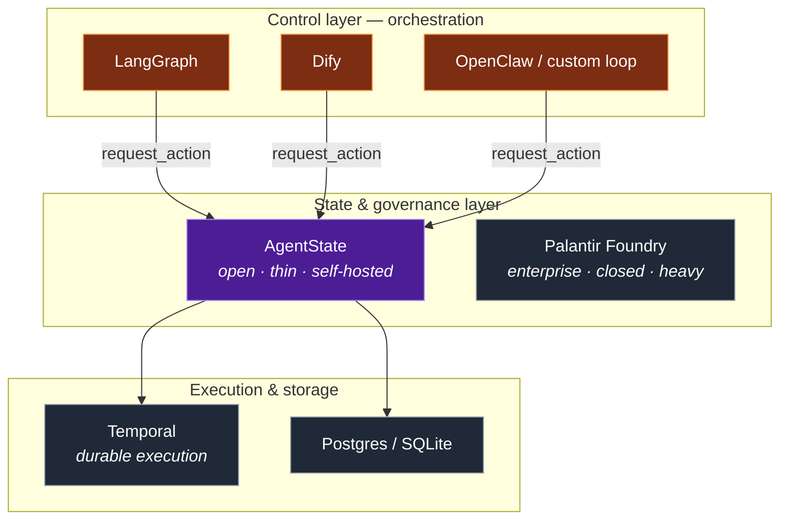

# How AgentState compares

A map of the neighborhood, and where AgentState sits in it. The short version: it is **horizontal infrastructure that sits *under* the control layer**, and it is **complementary to**, not competitive with, most of the tools below.

---

## vs. agent frameworks — LangGraph, Dify, OpenClaw, AutoGPT-likes

**What they own:** the control layer — how agents are wired, how work is routed, which tool fires when, how state machines of *the conversation* advance.

**The difference:** they govern *the flow*; AgentState governs *the world*. A LangGraph node that "issues a refund" still calls some API directly. Point it at AgentState instead and that refund now passes a precondition, a role limit, a risk guard, and lands in an audit ledger. **They are upstream of AgentState**, and the right relationship is integration, not competition: an agent framework calls `request_action`.

## vs. Palantir Foundry

**What it owns:** exactly the same conceptual model — typed objects, actions with permissions, and audit — but built for the enterprise: a system of record over *your authoritative data*, with the cost and weight that implies.

**The difference:** Foundry is heavyweight, closed, and expensive, and its weight comes largely from integrating and maintaining connections to real authoritative systems. AgentState is the **thin, open, self-hosted** take on the same idea, aimed at the individual / small-team / edge cases where that layer is effectively empty today — where your data is already your own and a single-file SQLite ledger is enough. Same shape; opposite end of the cost/openness spectrum.

## vs. Temporal & durable-execution engines

**What they own:** running a workflow *reliably* — retries, timers, surviving crashes, exactly-once execution of long-running processes.

**The difference:** Temporal answers "did this workflow run to completion despite failures?" AgentState answers "is this change *allowed*, and what's the authoritative state now?" These are orthogonal and composable: you can drive `request_action` calls from inside a Temporal workflow. Temporal is a strong *philosophical* model, though — it took "durable execution" and made it a reusable primitive; AgentState aims to do the same for "governed state."

## vs. raw Postgres / SQLite + validators

**What it owns:** storage, and whatever ad-hoc checks you write around it.

**The difference:** this *is* what AgentState is built on, and for a single guarded action it may be all you need. AgentState's value appears when the **governance grammar repeats**: idempotency-via-state, role-tiered limits, escalation-to-approval, derived-fact risk checks, completion gates, deadline tracking, and a complete ledger — across many actions and many apps. It turns that recurring grammar into a declared, tested primitive instead of bespoke if-else you rewrite each time.

## vs. workflow / no-code builders — Airtable, n8n, Zapier, multi-dimensional tables

**What they own:** letting non-developers assemble data and automations through a UI.

**The difference:** those are *applications* (or app builders) with a human at the controls. AgentState is *infrastructure* for **agents** — its first-class concern is "what is an autonomous LLM allowed to change, and how is every change governed and recorded." Different user (a developer wiring an agent vs. an ops person clicking), different primitive (a governed action boundary vs. a spreadsheet automation).

---

## One-line summary

| If you need… | Reach for |
|--------------|-----------|
| To orchestrate which agent/tool runs | An agent framework (LangGraph, Dify) |
| A workflow to survive crashes & retries | Temporal |
| An enterprise system of record over authoritative data | Palantir (or build the integration layer) |
| To store data and check a single thing | Postgres + a validator |
| **A reusable, governed boundary between an LLM and the few operations that change your world** | **AgentState** |
